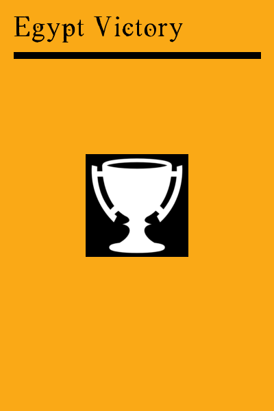

# Battles in Antiquity

This is a prototype card game which uses Python for technical implementation.

## Setup

    pip install -r requirements.txt

## Design iteration

Card statistics are defined in this
[Google sheet](xxx), but any CSV would work.
Asset images are in the [assets](assets) folder.

[make_game.sh](make_game.sh)
has examples of all code for different types of play testing:

  * Generate card images from CSV data.
  * Combine card images to PDF for print & play.
  * Convert card images to 
    [Tabletop simulator](https://www.tabletopsimulator.com/)
    deck templates.
  * Upload card images to
    [The Gamecrafter](https://www.thegamecrafter.com/).

## Generate card images

As an example

    python generate_victory_cards.py

does the following:

  * Reads card definitions from Google Sheets (CSV).
    Example from CSV:
    
        Card count,Empire,Name,Description
 	    4,Egypt,Egypt Victory,{influence_big}

  * Converts each card to "JSON data", so a dictionary of elements.
    Example: `{"Card count": 4, "Empire": "Egypt", ...}`.
  * Adds to each card rendering data.
    [assets.py](assets.py) 
    reads the asset directory to Python objects and
    defines a Python dictionary of all assets such as images and fonts.
    [renderable_card.py](renderable_card.py)
    attaches all rendering data to cards, so each card has all assets for example.
  * Renders each card and writes card PNG to output folder.

Example output image:
.

## PDF: print & play

Example that converts PNGs to PDF:

    python -m pycards.pdf \
      --input ./data/playing_cards/ \
      --output ./data/pdf/playing_cards.pdf

## Tabletop simulator deck template export

Example:

    python -m tts_utils.create_tts_deck \
        --input data/battle_victory_cards \
        --back data/deck_back_victory.png \
        --output data/deck_template_battle_victory

See
[tts-utils](https://github.com/jukujala/tts-utils)
for more information.

## The Gamecrafter (TGC) upload

Example that uploads card images to existing deck in TGC:

    python -m tgc_utils.convert_card_images \
      --input ./data/battle_victory_cards \
      --output ./data/battle_victory_cards_tgc

    python -m tgc_utils.upload_cards \
      --input ./data/battle_victory_cards_tgc \
      --deck_id <you define> \
      --secrets_json <you define>

See
[tgc-utils](https://github.com/jukujala/tgc-utils)
for more information.
